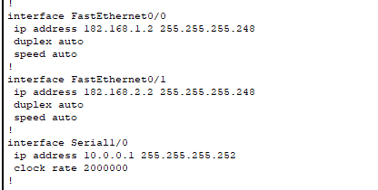
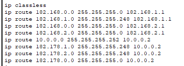
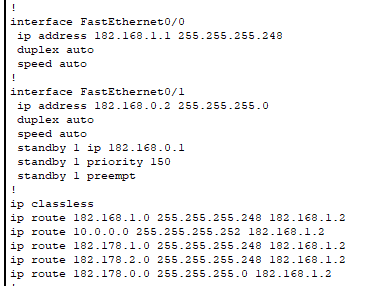
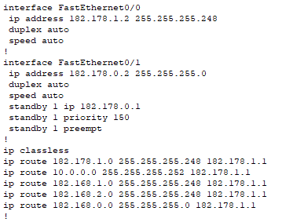
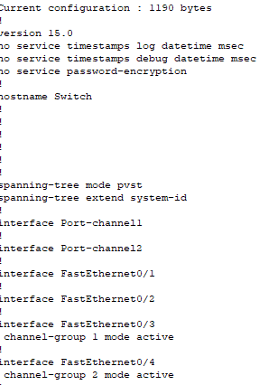
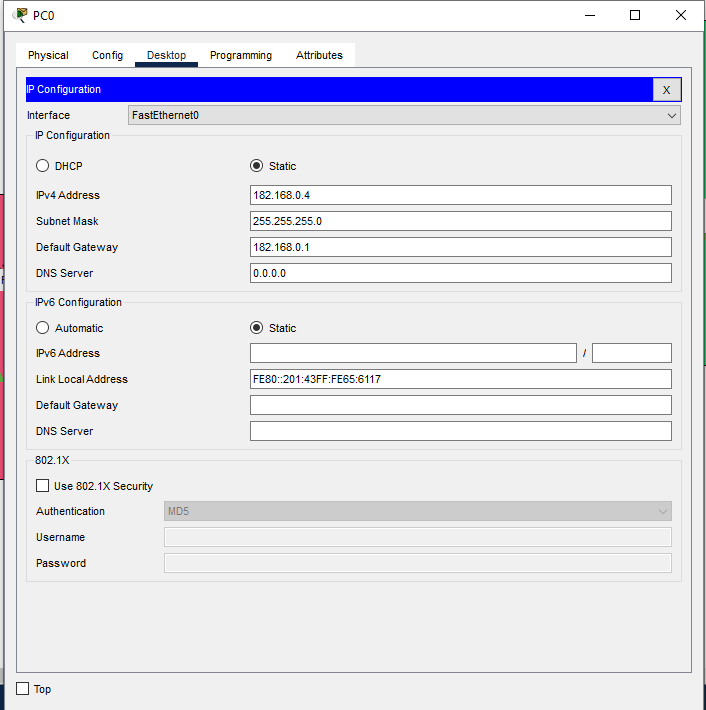

# Configuraciones

## Router 1


## Router 2

## Router 5

## Switch 2

## PC1


# Resumen de comandos

1. creacion de ruta estatica
```
Router(config)#ip route 182.168.1.0 255.255.255.248 182.168.1.2
```

2. creacion de portchannel con pagp
```
Switch1(config)# int fa0/1
Switch1(config-if)# channel-group 1 mode desirable
```

3. creacion de portchannel con lacp
```
Switch1(config)# int fa0/1
Switch1(config-if)# channel-group 1 mode active
```

4. creación de IP virtual con HSRP
```
Router1(config)# interface FastEthernet0/0
Router1(config-if)# standby 1 ip 192.168.1.1
Router1(config-if)# standby 1 priority 110
Router1(config-if)# standby 1 preempt
```

5. Verificacion
```
sh standby 
sh etherchannel summary
sh run
```
