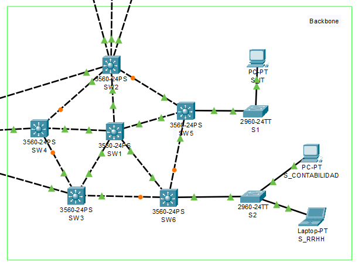

# Proyecto 1
## Redes de computadoras 1
##### David Noriega 202113378
##### Sebastián Godoy 202002940
-------------------------------------------------
### 1. Resumen de direcciones IP y VLAN
La red propuesta cuenta con 4 departamentos, cada departamento es identificado por una VLAN con terminacion XY, donde:

X = Numero de departamento (1 para contabilidad, 2 para secretaría, 3 para recursos humans y 4 para IT)
Y = Suma del último dígito de los integrantes del grupo. En este caso, 0+8=8

Las VLAN se muestran de la siguiente forma:


| Departamento      | VLAN |
|-------------------|------|
| Contabilidad      | 18   |
| Secretaría       | 28   |
| Recursos Humanos | 38   |
| IT                | 48   |

Las direcciones IP se asignan de una manera similar, con el formato 192.168.1X.0/24, donde X es la suma de las terminaciones de carnés. Las direcciones IP se muestran de la siguiente forma:

Ejemplo con IT1


### 2. Topología de red
Demostración de la topología de red propuesta.

Centro administrativo

Backbone

Área de trabajo

### 3. Detalle de los comandos usados
```
config t
```
Este comando se utiliza para entrar al modo de configuración global. 
```
vtp mode [modo]
```
Este comando se utiliza para especificar el modo de operación del Protocolo de Transporte de VLAN (VTP). El [modo] puede ser server, client, o transparent, dependiendo del caso.
```
vtp domain P1
```
Este comando se utiliza para especificar el dominio VTP al que pertenece el dispositivo. En este caso, el dominio se denomina "P1".
```
vtp password usac:
```
 Este comando se utiliza para especificar la contraseña de administración para el dominio VTP. En este caso, la contraseña se establece como "usac".
```
interface range fa0/n-m
```
Este comando se utiliza para seleccionar un rango de interfaces para configurar. En este caso, selecciona un rango de interfaces FastEthernet (fa0) del n-ésimo al m-ésimo.
```
switchport trunk encapsulation dot1q
```
Este comando se utiliza para especificar el método de encapsulación para las tramas VLAN en un puerto trunk. dot1q es el estándar IEEE 802.1Q para encapsulación de tramas VLAN.
```
switchport mode trunk
```
Este comando se utiliza para configurar un puerto como un trunk, lo que significa que el puerto puede transportar múltiples VLAN a través de él.
```
switchport trunk allowed vlan [vlans]
```
Este comando se utiliza para especificar qué VLAN están permitidas en un puerto trunk. Puedes especificar una lista de números de VLAN separados por comas.
```
do wr
```
Este comando ejecuta el comando "write memory" para guardar la configuración actual en la memoria persistente del dispositivo. En Packet Tracer, el comando "write memory" se abrevia como "wr".
```
end
```
Este comando se utiliza para salir del modo de configuración y volver al modo privilegiado.

### 4. Ping entre hosts
Primer ping

Segundo ping
